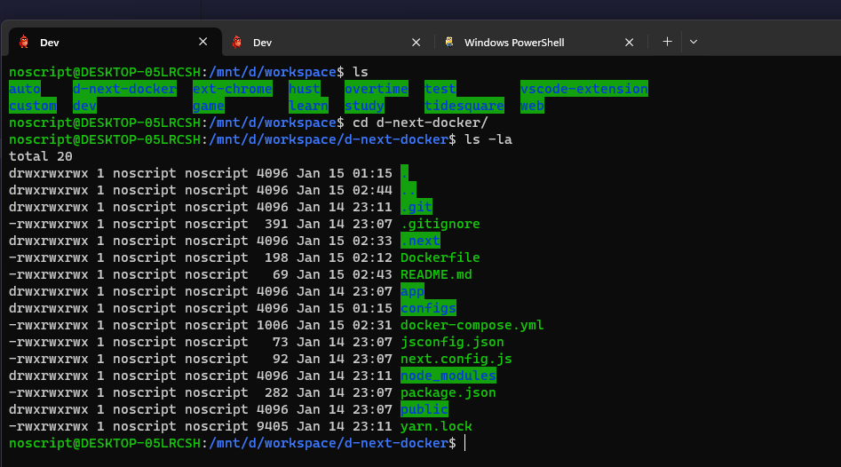
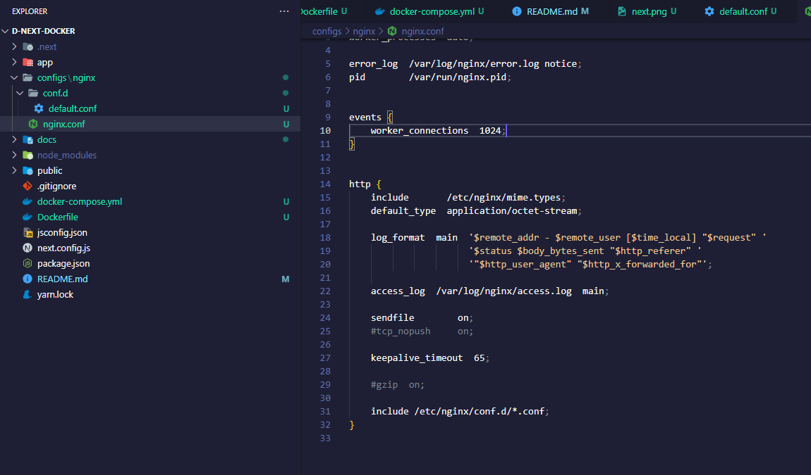
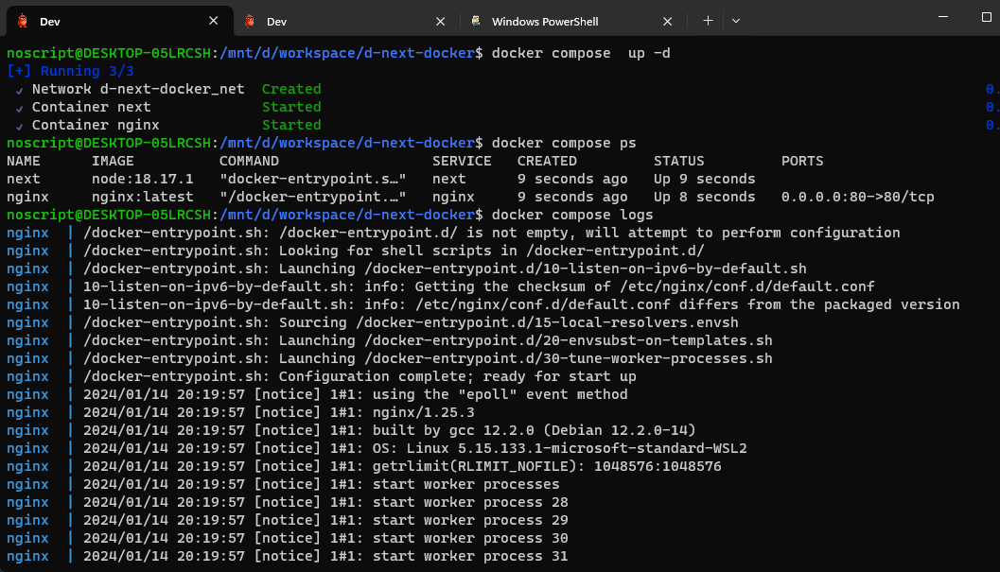
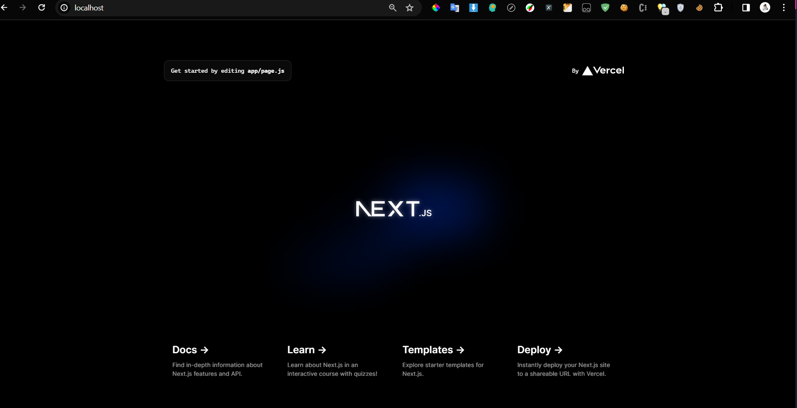

#### Step 1 : Create next app

```bash
yarn create next-app
```



#### Step 2 : Nginx , docker-compose.yml

> Copied default Nginx configuration.

```bash

mkdir -p configs/nginx
docker run --rm -v ./:/home nginx cp /etc/nginx/nginx/nginx.conf /home/configs/nginx
docker run --rm -v ./:/home nginx cp -r /etc/nginx/nginx/conf.d /home/configs/nginx
```



---

> Write a script for docker-compose.yml

```yml
version: "3"

volumes:
  share:
    driver: local
    driver_opts:
      device: ${PWD}/
      o: bind
      type: none

networks:
  net:
    driver: bridge

services:
  # next:
  #   build:
  #     context: .
  #     dockerfile: Dockerfile
  #   container_name: next
  #   restart: always
  #   networks:a
  #     - net

  next:
    image: node:18.17.1
    working_dir: /home/app
    container_name: next
    restart: always
    networks:
      - net
    volumes:
      - share:/home/app
    command:
      - bash
      - "-c"
      - |
        apt update && apt list --upgradable &&
        yarn && yarn build && yarn start

    # ports:
    #   - "3000:3000"

  nginx:
    image: "nginx:latest"
    container_name: nginx
    restart: always
    networks:
      - net
    volumes:
      - ./configs/nginx/nginx.conf:/etc/nginx/nginx.conf
      - ./configs/nginx/conf.d:/etc/nginx/conf.d
    ports:
      - "80:80"
    depends_on:
      - next
```

---

> Proxy setup within an Nginx configuration **default.conf** file.

```.conf
server {
    listen 80;

    server_name localhost;

    location / {
        proxy_pass http://next:3000;
        proxy_set_header Host $host;
        proxy_set_header X-Real-IP $remote_addr;
        proxy_set_header X-Forwarded-For $proxy_add_x_forwarded_for;
        proxy_set_header X-Forwarded-Proto $scheme;
    }

    error_page 500 502 503 504 /50x.html;
    location = /50x.html {
        root /usr/share/nginx/html;
    }
}

```



#### Demo host



#### References

- Docs <a href='https://docs.docker.com/desktop/'>Docker</a>
- <a href='https://xuanthulab.net/gioi-thieu-ve-docker-lam-quen-voi-docker-tao-container.html'>Base</a>
- Support <a href='https://chat.openai.com'>Chatgpt</a>
- Commands linux <a href='https://www.redhat.com/sysadmin/10-commands-terminal'>Redhat</a>
